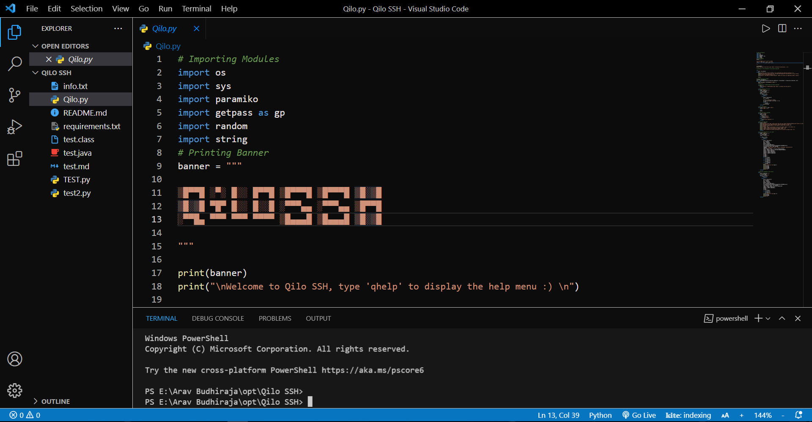

# XTRA Dark

#### XTRA Dark is a clean and simple dark theme which can be used in <a href="https://code.visualstudio.com">Visual Studio Code</a>

## Setup

1. Find the folder where VS Code is installed
2. In that folder navigate to this folder "resources\app\extensions\theme-defaults\themes"
3. Copy and paste the JSON file, "XTRA Dark-color-theme.json" in this folder. The JSON file is located in the themes folder of this repo
4. Go back to "resources\app\extensions" and add the "xtra-dark" folder here
5. Open VS Code and click on the settings(bottom left corner) and then click on "Color Theme"
6. Select XTRA Dark

***
